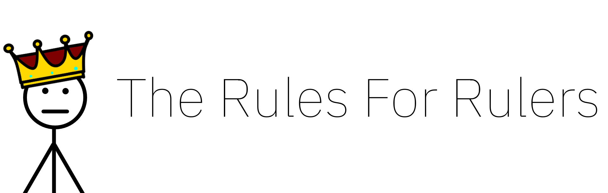

# The Rules for Rulers
A HTML javascript game based off of the [CGP Grey](https://www.youtube.com/channel/UC2C_jShtL725hvbm1arSV9w) [video](https://youtu.be/rStL7niR7gs) "The Rules For Rulers"

## Play
[Play the game here!](https://eclipselikesspace.github.io/The-Rules-For-Rulers/public/)

## License
GNU General Public License v3

## Deployment

Install the required dependencies and run

```bash
npm run build
```

This will build the typescript source, then you can just open up the `index.html` and *voila!*
